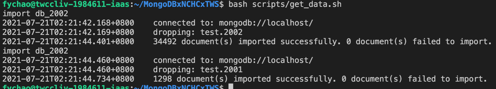
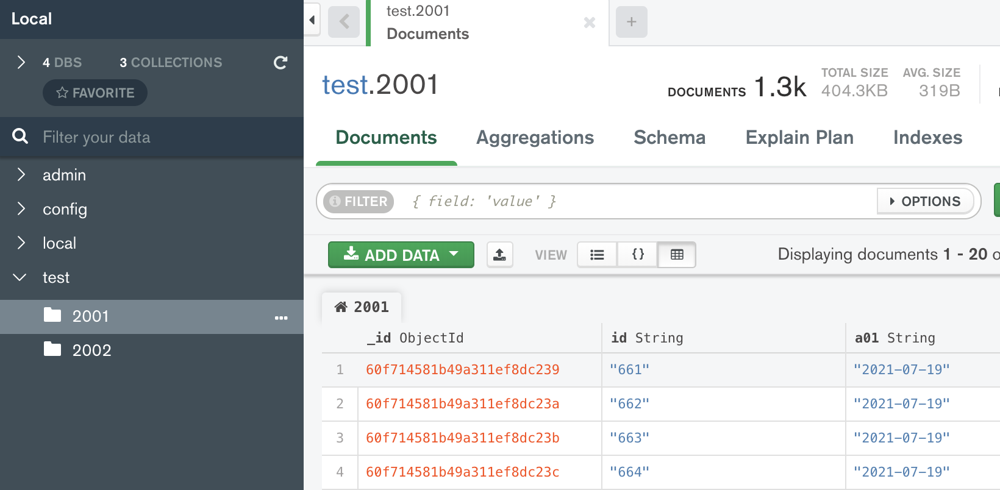
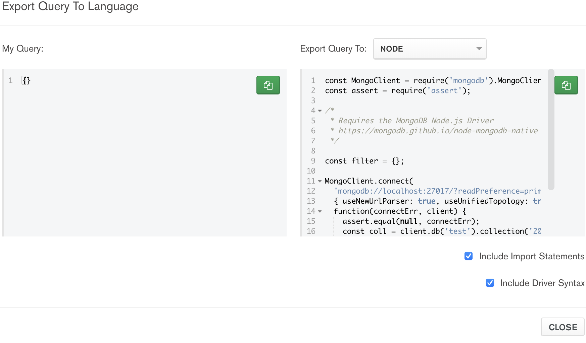
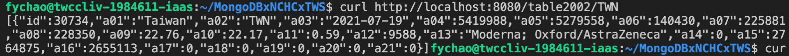
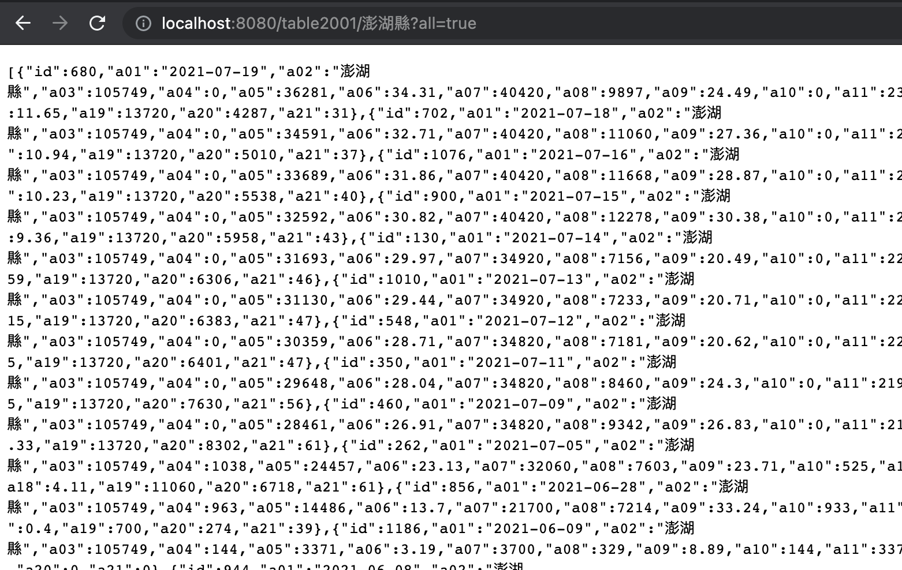

# NCHC Vaccination Dataset to MongoDB

## Prerequisite 

1. need [MongoDB v5.0.0](https://docs.mongodb.com/v5.0/release-notes/5.0/)
2. nodejs 
```bash=
curl -fsSL https://deb.nodesource.com/setup_lts.x | sudo -E bash -
sudo apt-get install -y nodejs
```

## Installation

```
git clone https://github.com/twcc/MongoDBxNCHCxTWS
cd MongoDBxNCHCxTWS
npm install
```

## Fetch Data from Covid19.NCHC

```
bash script/get_data.sh
```

Latest Data from Covid19.NCHC.org.tw will be import to your local MongoDB. 



Datasets are:
- [Internal Vaccination Dataset](https://covid-19.nchc.org.tw/api.php?tableID=2002)
- [Taiwan Vaccination Dataset](https://covid-19.nchc.org.tw/api.php?tableID=2001)


If you already installed [MongoDB Compass](https://www.mongodb.com/products/compass), you can try to access this MongoDB, it looks like


> [MongoDB Compass](https://www.mongodb.com/products/compass) is very good tool. It can help you generate sample call specially while you using [Pipeline](https://docs.mongodb.com/manual/core/aggregation-pipeline/) in your project. Code generator like this, 
> 
> 

## Run in your VCS

```
node src/app.js
```

Your service will be at port: **8080**.


### avbl. API calls

- Internal Vaccination Dataset: '/table2002/', '/table2002/:iso_code/'
- Taiwan Vaccination Dataset: '/table2001/', '/table2001/:iso_code/'

samples from command line calls:
```
curl http://localhost:8080/table2002/TWN
curl http://localhost:8080/table2002/TWN?all=true
```

and it looks like this (in Visual Studio Code)



open browser to [http://localhost:8080/table2001/澎湖縣?all=true](http://localhost:8080/table2001/%E6%BE%8E%E6%B9%96%E7%B8%A3?all=true) from browsers, and it looks like:



## Applications

- for Data Scientist, check out [beautiful](https://covid-19.nchc.org.tw/refineCards.php) and [understanderable](https://covid-19.nchc.org.tw/dt_002-csse_covid_19_daily_reports_vaccine_city2.php) graph hat Covid19.NCHC.org.tw can do. 
- for Machine Learning / AI Modeler, check out that [state-of-the-art studies](https://scholar.google.com/scholar?hl=zh-TW&as_sdt=0%2C5&q=Vaccination+covid+19+Taiwan&btnG=).

## Limitations

- This demestration using [Security Group in TWCC](https://man.twcc.ai/@twccdocs/guide-vcs-sg-zh) to protect MongoDB, you need to enable ["authorization"](https://docs.mongodb.com/manual/core/authentication/) according to MongoDB. I suggest you take [M150: Authentication & Authorization](https://university.mongodb.com/mercury/M150/2021_July_13) for best practices. 
- To access your MongoDB without having risck, I suggest you using [ssh tunneling](https://www.ssh.com/academy/ssh/tunneling/example) for direct access. 
- Or use [TWCC-CLI](https://github.com/twcc/TWCC-CLI) command [_net_](https://twcc-cli.readthedocs.io/en/latest/twccli-net.html#net-vcs), ie: `twccli net vcs`, to control your [VCS security](https://man.twcc.ai/@twccdocs/guide-vcs-sg-zh) under proper ["authorization"](https://docs.mongodb.com/manual/core/authentication/) setting.
